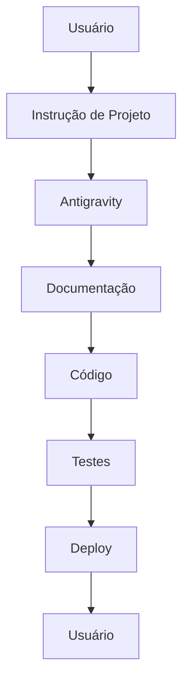

# AI Agents Integration — Integração com Agentes de IA

## Visão Geral

Este guia define como integrar agentes de IA (como Antigravity) no fluxo de desenvolvimento do projeto.

---

## Tipos de Agentes

### 1. Agentes de Código

**Propósito:** Gerar, revisar e refatorar código.

**Exemplos:**
- Antigravity
- GitHub Copilot
- Cursor
- Codeium

**Casos de Uso:**
- Gerar código a partir de especificação
- Refatorar código existente
- Escrever testes
- Debugar issues

---

### 2. Agentes de Design

**Propósito:** Gerar e iterar em designs.

**Exemplos:**
- Google Stitch
- Galileo AI
- Uizard
- Figma AI

**Casos de Uso:**
- Gerar telas a partir de prompt
- Iterar em designs existentes
- Exportar assets
- Validar acessibilidade

---

### 3. Agentes de Documentação

**Propósito:** Criar e manter documentação.

**Exemplos:**
- Antigravity (documentação)
- Notion AI
- GitBook AI

**Casos de Uso:**
- Gerar README a partir de código
- Criar docs de API
- Manter changelog
- Traduzir documentação

---

### 4. Agentes de Teste

**Propósito:** Gerar e executar testes.

**Exemplos:**
- Testim
- Applitools
- Antigravity (testes)

**Casos de Uso:**
- Gerar testes a partir de código
- Testes visuais
- Testes E2E
- Relatórios de cobertura

---

## Integração com Antigravity

### Workflow Principal



### Passos do Workflow

1. **Instrução de Projeto**
   - Usuário define visão, requisitos, design
   - Antigravity valida entendimento

2. **Documentação**
   - Antigravity gera documentação estruturada
   - Usuário valida e aprova

3. **Código**
   - Antigravity implementa seguindo documentação
   - Validação contínua

4. **Testes**
   - Antigravity gera testes
   - Usuário executa e valida

5. **Deploy**
   - Antigravity configura deploy
   - Usuário aprova produção

---

## Prompts e Instruções

### Instrução de Projeto

**Propósito:** Definir o projeto para o agente.

**Estrutura:**

```md
# Instrução de Projeto

## Visão
[Descrição da visão do produto]

## Requisitos
- Requisito 1
- Requisito 2
- Requisito 3

## Design
[Referência de design ou Stitch]

## Restrições
- Restrição 1
- Restrição 2

## Critérios de Sucesso
- Critério 1
- Critério 2
```

**Exemplo:**

```md
# Instrução de Projeto: ComixFlix

## Visão
Plataforma de descoberta e acompanhamento de quadrinhos, agregando dados de múltiplas editoras.

## Requisitos
- Listar quadrinhos de múltiplas fontes
- Filtrar por editora, personagem, preço
- Acompanhar coleção pessoal
- Scrapers de Panini e Mythos
- Design do Google Stitch

## Design
- Projeto Stitch: comixflix-design-123
- Fidelidade: exact (> 95%)

## Restrições
- Mobile-first
- Performance: < 3s load time
- Acessibilidade: WCAG AA

## Critérios de Sucesso
- 100% das telas do Stitch implementadas
- Scrapers funcionando com deduplicação
- Coleção pessoal CRUD completo
- Deploy em produção
```

---

### Instrução de Design

**Propósito:** Definir design para o agente.

**Estrutura:**

```md
# Instrução de Design

## Projeto Stitch
- ID: [project-id]
- Nome: [project-name]

## Fidelidade
- Nível: [exact | close | inspired]
- Tolerância: [X%]

## Telas
- Tela 1: [nome]
- Tela 2: [nome]

## Componentes
- Componente 1: [nome]
- Componente 2: [nome]

## Assets
- Asset 1: [nome]
- Asset 2: [nome]
```

**Exemplo:**

```md
# Instrução de Design: ComixFlix

## Projeto Stitch
- ID: comixflix-design-123
- Nome: ComixFlix Design

## Fidelidade
- Nível: exact
- Tolerância: < 5%

## Telas
- Home
- Explorar
- Detalhes do Quadrinho
- Minha Coleção
- Login
- Registro

## Componentes
- ComicCard
- ComicList
- BottomNav
- SearchBar
- FilterDrawer

## Assets
- Logo (SVG)
- Ícones (Lucide)
- Ilustrações (WebP)
```

---

### Prompt de Implementação

**Propósito:** Instruir implementação específica.

**Estrutura:**

```md
# Prompt: [Nome da Feature]

## Contexto
[Descrição do contexto]

## Tarefa
[Descrição da tarefa]

## Requisitos
- Requisito 1
- Requisito 2

## Exemplos
[Exemplos de input/output]

## Restrições
- Restrição 1
- Restrição 2
```

**Exemplo:**

```md
# Prompt: Implementar ComicCard

## Contexto
Precisamos de um card de quadrinho para listagem na home e explorar.

## Tarefa
Implementar componente ComicCard com:
- Capa do quadrinho
- Título
- Editora
- Preço
- Badge de lançamento (se aplicável)

## Requisitos
- Responsivo (mobile e desktop)
- Hover effect sutil
- Acessível (alt text, focus states)
- Fidelidade ao Stitch: > 95%

## Exemplos
Input: Comic object
Output: Card component renderizado

## Restrições
- Usar Tailwind
- Ícones Lucide
- Sem dependências extras
```

---

## Validação de Output

### Checklist de Validação

**Código:**
- [ ] Segue especificação
- [ ] TypeScript sem erros
- [ ] ESLint passando
- [ ] Testes passando
- [ ] Performance aceitável

**Documentação:**
- [ ] Completa
- [ ] Clara
- [ ] Atualizada
- [ ] Exemplos presentes

**Design:**
- [ ] Fidelidade verificada
- [ ] Responsivo
- [ ] Acessível
- [ ] Assets otimizados

---

### Relatório de Validação

```md
# Relatório de Validação: [Feature]

## Status
`aprovado` | `aprovado-com-reservas` | `reprovado`

## Validações

### Código
- [x] TypeScript sem erros
- [x] ESLint passando
- [x] Testes passando (12/12)
- [ ] Performance (pendente)

### Documentação
- [x] README atualizado
- [x] Exemplos presentes

### Design
- [x] Fidelidade: 97% (> 95% OK)
- [x] Responsivo testado
- [x] Acessibilidade verificada

## Issues
1. Performance: LCP 3.2s (meta: < 2.5s)

## Próximos Passos
1. Otimizar imagens da home
2. Re-validar performance
```

---

## Integração com Ferramentas

### GitHub

**Workflow:**
1. Antigravity gera código
2. Cria branch feature
3. Commit com mensagem clara
4. Push para GitHub
5. Cria PR (opcional)

**Configuração:**
```env
GITHUB_ENABLED=true
GITHUB_OWNER=comixflix
GITHUB_REPOSITORY=comixflix-app
GITHUB_CREATE_BRANCH=true
GITHUB_CREATE_PR=false
```

---

### Google Stitch

**Workflow:**
1. Antigravity lê projeto Stitch
2. Importa telas e componentes
3. Valida fidelidade
4. Gera código fiel

**Configuração:**
```env
GOOGLE_STITCH_ENABLED=true
GOOGLE_STITCH_PROJECT_ID=comixflix-design-123
GOOGLE_STITCH_FIDELITY=exact
```

---

### Firebase

**Workflow:**
1. Antigravity configura Firebase
2. Cria collections
3. Popula com seeds
4. Valida conexão

**Configuração:**
```env
FIREBASE_ENABLED=true
FIREBASE_PROJECT_ID=comixflix-prod
FIREBASE_CREATE_COLLECTIONS=true
FIREBASE_SEED=true
```

---

## Melhores Práticas

### 1. Especificação Clara

**Bom:**
```md
Implementar tela de login com:
- Email input
- Senha input
- Botão "Entrar"
- Link "Esqueci senha"
- Validação de email
- Validação de senha (min 6 chars)
```

**Ruim:**
```md
Fazer tela de login
```

---

### 2. Validação Contínua

**Bom:**
```md
Após cada feature:
1. Validar código
2. Executar testes
3. Validar design
4. Reportar status
```

**Ruim:**
```md
Implementar tudo e validar no final
```

---

### 3. Iteração Rápida

**Bom:**
```md
Feature pequena → Validação → Ajuste → Próxima feature
```

**Ruim:**
```md
Todas as features → Validação → Muitas issues → Retrabalho
```

---

### 4. Documentação Viva

**Bom:**
```md
Documentação atualizada junto com código:
- README
- Changelog
- ADRs
```

**Ruim:**
```md
Documentação desatualizada
```

---

## Troubleshooting

### Agente Não Entende Contexto

**Sintoma:** Output não alinhado com expectativa.

**Solução:**
- Fornecer mais contexto
- Usar exemplos claros
- Quebrar em tarefas menores
- Validar entendimento antes

---

### Agente Alucina

**Sintoma:** Inventa APIs, dados, comportamentos.

**Solução:**
- Seguir `anti-hallucination-rules.md`
- Validar fontes de dados
- Declarar "desconhecido" quando necessário
- Usar fallback explícito

---

### Agente Não Segue Design

**Sintoma:** Implementação diverge do design.

**Solução:**
- Fornecer Stitch ID
- Especificar fidelidade
- Validar após cada tela
- Reportar divergências

---

## Checklist de Integração

### Setup

- [ ] Agente configurado
- [ ] Variáveis de ambiente definidas
- [ ] Integrações (GitHub, Stitch, etc.) configuradas

### Workflow

- [ ] Instrução de projeto clara
- [ ] Instrução de design clara
- [ ] Prompts específicos para features
- [ ] Validação contínua

### Qualidade

- [ ] Código validado
- [ ] Testes passando
- [ ] Documentação atualizada
- [ ] Design fiel

### Segurança

- [ ] Secrets em variáveis de ambiente
- [ ] Tokens não commitados
- [ ] Permissões mínimas

---

## Referências

- `GLOBAL-RULES.md` — Regras globais
- `anti-hallucination-rules.md` — Regras anti-alucinação
- `integration-contracts.md` — Contratos de integração
- `mcp-servers.md` — MCP servers
- `2.instrucao-projeto.md` — Instrução de projeto
- `2.instrucao-design.md` — Instrução de design